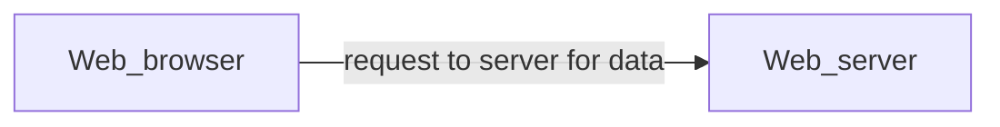
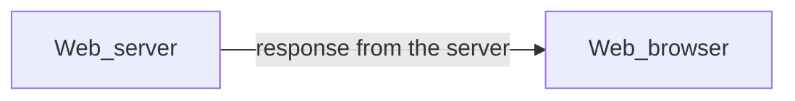

# HTTP

## what is HTTP ?

- Application player protocol for transmitting hypermedia document such as HTML
- Designed for communication between web server and web browser
- Stateless protocol (does not keep any data)
- Basic of HTTP visualization:

### Client - user agent

- The user-agent is any tool that acts on behalf of the user
- The browser is **always** the entity initiate the request

### Server

- The place handle business logic and return data for client to use
- Server can be a virtual machine or a collection of virtual machines
- A server is not really a single machine, but multiple server instances can be on the same machine.

### Proxies

- Lying in the middle of client and server
- Can be transparent or non-transparent
  - Transparent: forwarding request to server with altering anything
  - Non-transparent: may change the request before sending to

## HTTP Access Control (CORS)
